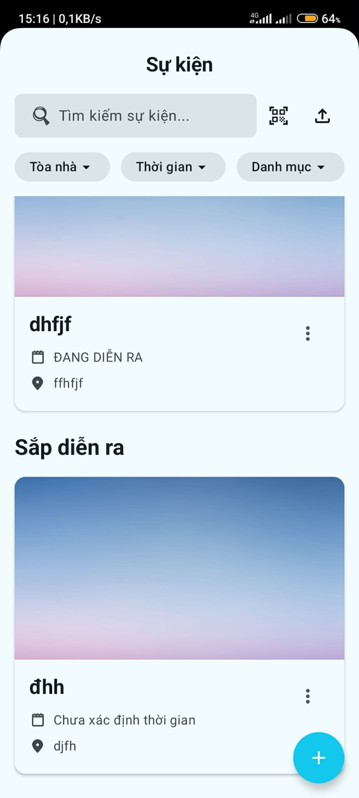
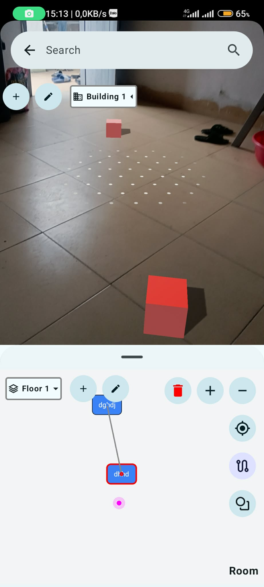
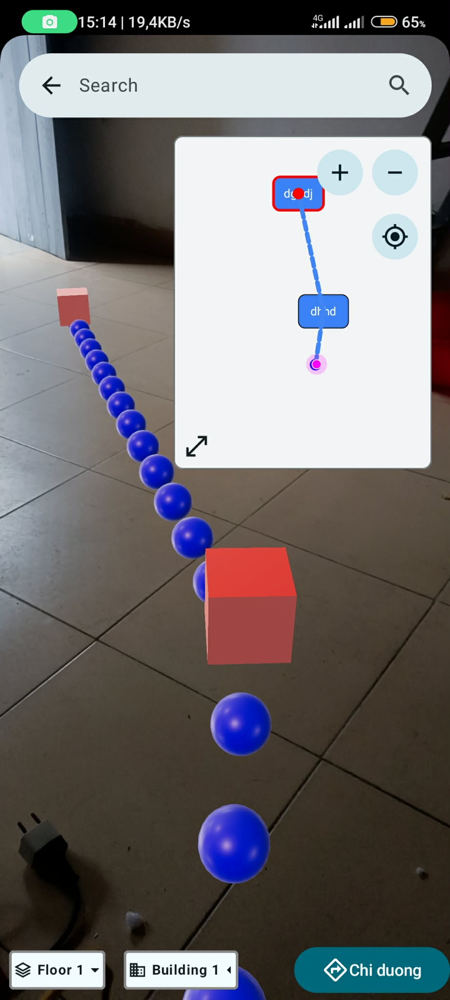
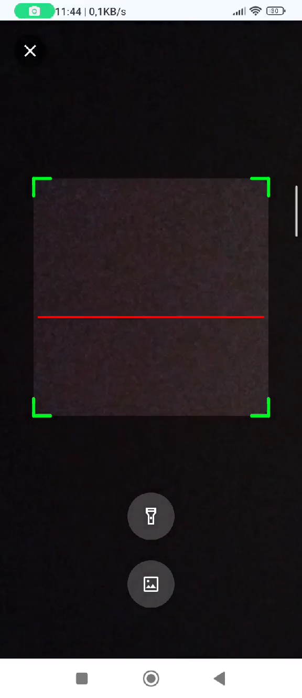

# MiniMap

MiniMap là một ứng dụng Android hỗ trợ quản lý sự kiện và định vị trong nhà (indoor navigation) tích hợp công nghệ Thực tế tăng cường (AR). Ứng dụng giúp người dùng dễ dàng tìm kiếm gian hàng, xem sơ đồ mặt bằng và điều hướng trong các không gian phức tạp như trung tâm triển lãm, tòa nhà văn phòng.

## 🚀 Tính năng chính

- **Danh sách sự kiện:** Xem thông tin chi tiết về các sự kiện, địa điểm (Venue) và các gian hàng (Booth).
- **Quét mã QR:** Nhanh chóng truy cập thông tin địa điểm hoặc sự kiện thông qua QR Code.
- **Bản đồ tương tác:**
    - **Map Viewer:** Xem sơ đồ mặt bằng và các điểm đến.
    - **Map Editor:** Công cụ chỉnh sửa, thiết lập các nút (Nodes) và đường nối (Edges) để phục vụ định vị.
- **Thực tế tăng cường (AR):** Tích hợp ARCore và Sceneform để hỗ trợ trải nghiệm hình ảnh trực quan và điều hướng.
- **Quản lý dữ liệu:** Lưu trữ thông tin về tòa nhà, tầng, gian hàng, nhà cung cấp (Vendor) và các kết nối giữa các tầng.

## 📸 Giao diện ứng dụng

|                                                   Màn hình chính                                                   |                                                         Bản đồ & AR                                                         |                                                             Quét QR                                                             |
|:------------------------------------------------------------------------------------------------------------------:|:---------------------------------------------------------------------------------------------------------------------------:|:-------------------------------------------------------------------------------------------------------------------------------:|
|  |  |  |

## 🛠 Công nghệ sử dụng

- **Ngôn ngữ:** Kotlin
- **UI Framework:** Jetpack Compose (Modern Android UI)
- **Kiến trúc:** MVVM, Clean Architecture
- **Dependency Injection:** Dagger Hilt
- **Cơ sở dữ liệu:** Room Persistence Library
- **Navigation:** Navigation Compose (with Type-safe Navigation)
- **AR/3D:** ARCore & Sceneform
- **Khác:** Kotlin Serialization, Splash Screen API

## 📂 Cấu trúc dự án

Dự án được chia thành các module chính:
- `:app`: Module chính chứa logic nghiệp vụ, UI và dữ liệu của ứng dụng.
- `:sceneformsrc`: Thư viện lõi Sceneform được tùy chỉnh để xử lý hiển thị 3D/AR.
- `:sceneformux`: Các thành phần giao diện người dùng (UX) hỗ trợ AR.

## 🏗 Cài đặt

1. Clone dự án:
   ```bash
   git clone https://github.com/your-username/minimap.git
   ```
2. Mở dự án bằng **Android Studio (Ladybug hoặc mới hơn)**.
3. Chờ Gradle đồng bộ hóa các phụ thuộc.
4. Chạy ứng dụng trên thiết bị Android hỗ trợ ARCore.

---
*Dự án đang trong quá trình phát triển.*
